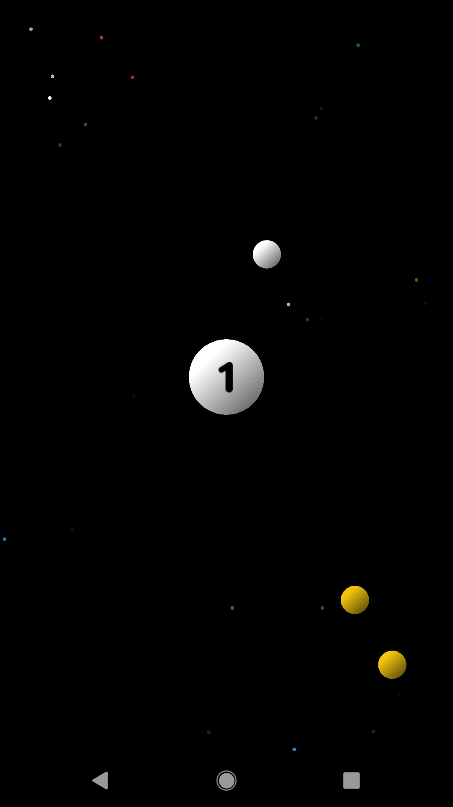
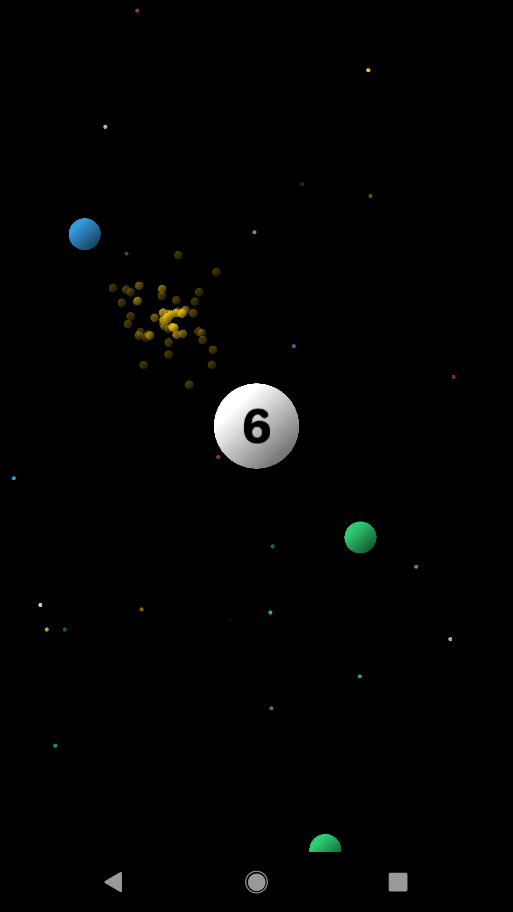
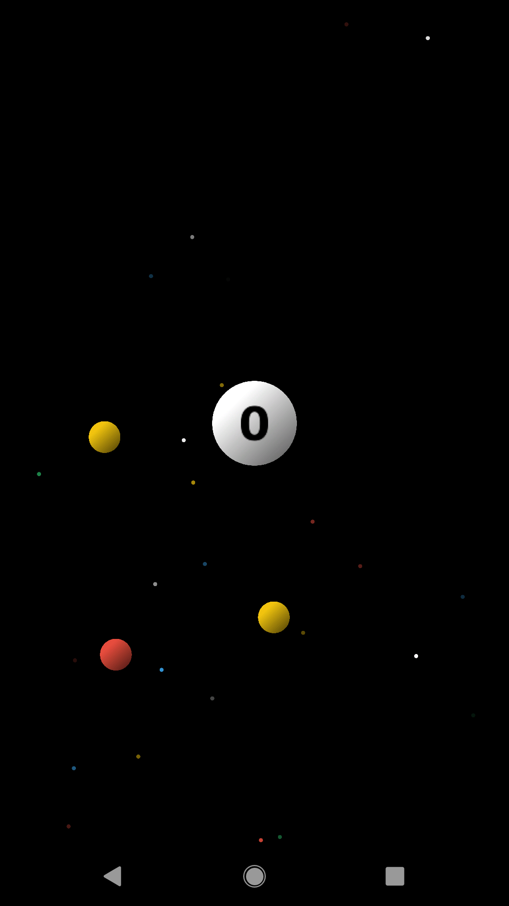
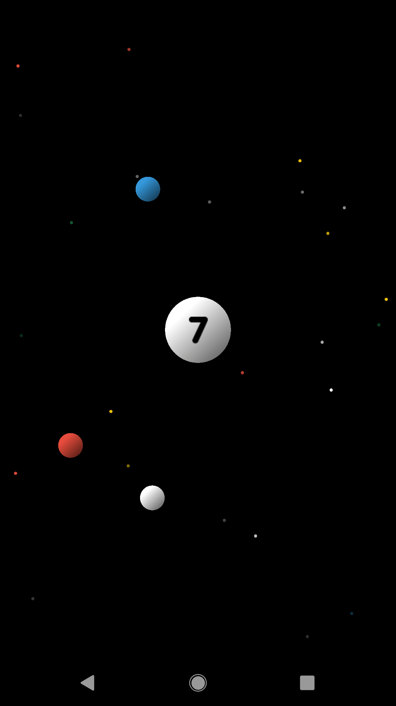

# color-shooter
[](https://github.com/dulvui/color-shooter/actions/workflows/upload-ios.yml)
[](https://github.com/dulvui/color-shooter/actions/workflows/upload-android.yml) 

**This game is archived and no longer available on Google Play Store.**   
My very first game created with libGDX.  
Let the white balls reach the centre and tap to shoot the other colored balls.

<div>
  
  
  
  
</div>

## Table of contents
- [color-shooter](#color-shooter)
  - [Table of contents](#table-of-contents)
- [Getting started](#getting-started)
  - [Run it on your device](#run-it-on-your-device)
- [Contributions](#contributions)
- [Licenses](#licenses)
  - [Third party assets](#third-party-assets)

# Getting started

Take a look at the official libGDX [documentation](https://libgdx.com/dev/) on how to get started with libGDX and how to setup the project.  
Or just contact me at info@simondalvai.com, I'll help you to get started and update this README, so that others can also contribute. But until that doesn't happen, I'm too lazy to write a setup documentation.

## Run it on your device
You can install and make release and debug releases with the gradlew wrapper located in `src/gradlew`.  
To run it on your attached device run
```
./gradlew installDebug
```
To make a debug aab build run
```
./gradlew assembleDebug
```

# Contributions
If you want to contribute to the project, please fork the repo,    
make your changes and make a pull request with a short description  
of the changes you made.

# Licenses
The game itself is licensed under the [GNU AGPL v3.0](LICENSE) license and all  
assets made by myself and not mentioned in the [Third party assets](#third-party-assets) section, are licensed under the [CC-BY-SA-4.0](https://creativecommons.org/licenses/by-sa/4.0/) license.

## Third party assets

Coin sound is made by [ProjectsU012](https://freesound.org/people/ProjectsU012/sounds/341695/) under the [CC-BY-4.0](https://creativecommons.org/licenses/by/4.0/) license.  
[src/android/assets/sounds/coin.wav](src/android/assets/sounds/coin.wav)

Success sound is made by [jobro](https://freesound.org/people/jobro/sounds/60443/) under the [CC-BY-3.0](https://creativecommons.org/licenses/by/3.0/) license.  
[src/android/assets/sounds/success.wav](src/android/assets/sounds/success.wav)

Game over sound is made by [cabled_mess](https://freesound.org/people/cabled_mess/sounds/350985/) under the [CC0-1.0](https://creativecommons.org/publicdomain/zero/1.0/) license.  
[src/android/assets/sounds/game-over.wav](src/android/assets/sounds/game-over.wav)

Pop sound is made by [greenvwbeetle](https://freesound.org/people/greenvwbeetle/sounds/244652/) under the [CC0-1.0](https://creativecommons.org/publicdomain/zero/1.0/) license.  
[src/android/assets/sounds/pop.wav](src/android/assets/sounds/pop.wav)

Star and pause image by [kenney.nl](https://www.kenney.nl/assets/game-icons) are licensed under [CC0-1.0](https://creativecommons.org/publicdomain/zero/1.0/)  
[src/android/assets/images/star.png](src/android/assets/images/star.png)  
[src/android/assets/images/pause.png](src/android/assets/images/pause.png)

Font is made by [Hanken Design Co.](https://hanken.co/collections/free/products/jellee) under the [OFL](https://scripts.sil.org/cms/scripts/page.php?site_id=nrsi&id=ofl) license.  
[src/android/assets/jellee.roman.ttf](src/android/assets/jellee.roman.ttf)
