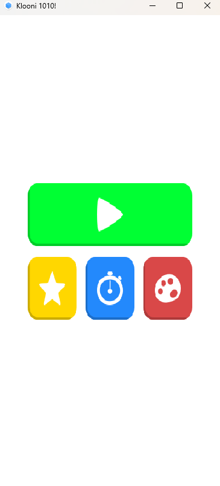
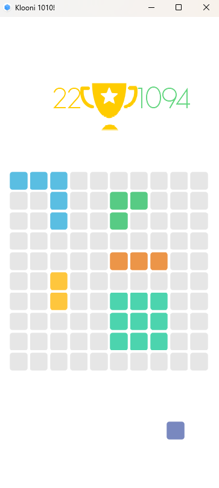

## Klooni 

------------------------------------------------------------------------------------

**Klooni 1010!** is a [libGDX](https://libgdx.com/) puzzle game, for putting blocks
beside each other and complete rows/columns.

This is a very good example of a standard 2D game in LibGDX.

### Some screen shots of the game world

 