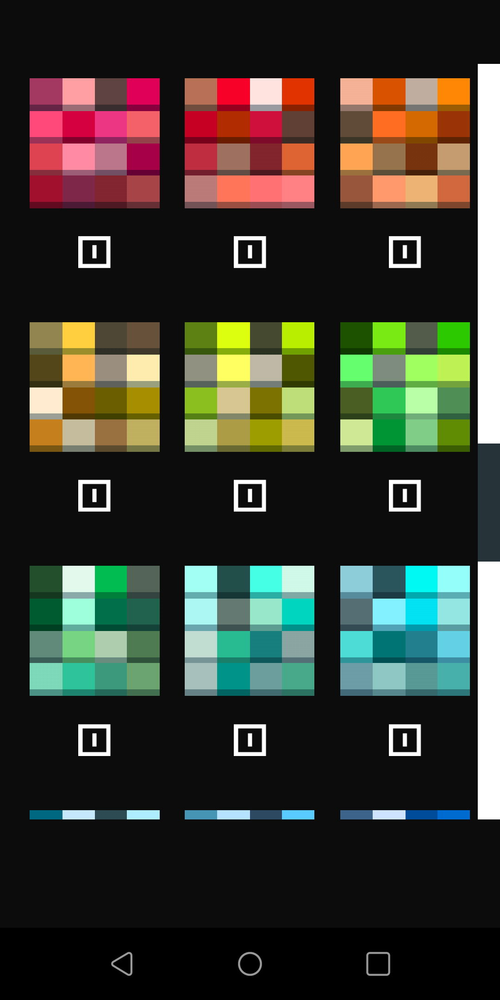
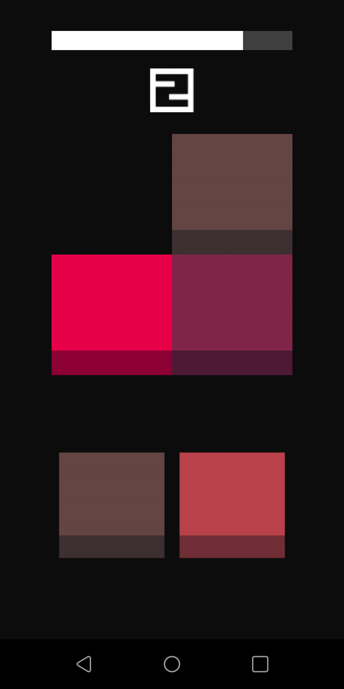
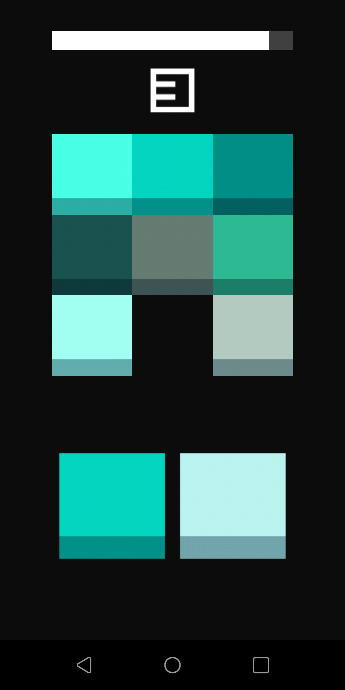
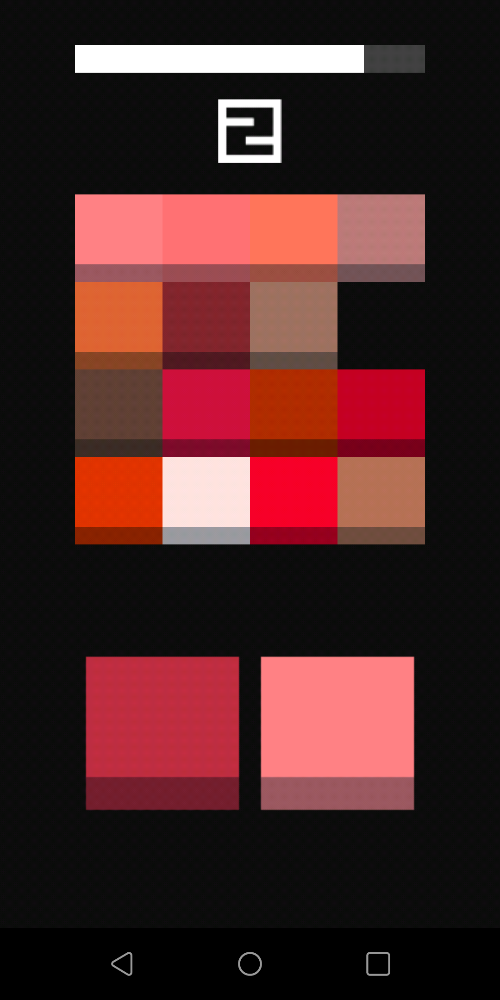

# WhatColor
Source code for the Android and iOS game WhatColor. Created with libGDX.

<a href="https://play.google.com/store/apps/details?id=com.salvai.whatcolor" target="_blank"></a>

<div>
  
  
  
  
</div>  


## Table of contents
- [WhatColor](#whatcolor)
  - [Table of contents](#table-of-contents)
  - [How to play](#how-to-play)
- [Getting started](#getting-started)
  - [Run it on your device](#run-it-on-your-device)
- [Contributions](#contributions)
- [Licenses](#licenses)
  - [Third party assets](#third-party-assets)

## How to play
You see a color pattern and then a color disappears. Click the missing color on the bottom until you loose.
Every correct color pick gives you 1 point. Reach 10 points or more for the next level.

# Getting started

Take a look at the official libGDX [documentation](https://libgdx.com/dev/) on how to get started with libGDX and how to setup the project.  
Or just contact me at info@simondalvai.com, I'll help you to get started and update this README, so that others can also contribute. But until that doesn't happen, I'm too lazy to write a setup documentation.

## Run it on your device
You can install and make release and debug releases with the gradlew wrapper located in `src/gradlew`.  
To run it on your attached device run
```
./gradlew installDebug
```
To make a debug aab build run
```
./gradlew assembleDebug
```

# Contributions
If you want to contribute to the project, please fork the repo,    
make your changes and make a pull request with a short description  
of the changes you made.

# Licenses
The game itself is licensed under the [GNU AGPL v3.0](LICENSE) license and all  
assets made by myself and not mentioned in the [Third party assets](#third-party-assets) section, are licensed under the [CC-BY-SA-4.0](https://creativecommons.org/licenses/by-sa/4.0/) license.

## Third party assets

The font is made by Brandon S. aka Tepid Monkey.  
You can find the font and the license on [1001fonts.com](https://www.1001fonts.com/origami-mommy-font.html)

`android/assets/skin/origa___.fnt`
